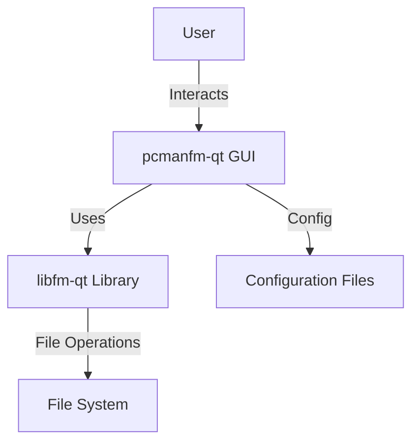

# Design Document

## High-Level Architecture
The project is built using C++ and the Qt 6 framework. It follows a modular architecture separating the core file management logic from the user interface.

## Core Components
- **pcmanfm-qt (Application):** The main executable. Handles window management, session lifecycle, and desktop integration.
- **libfm-qt:** A core library providing file management capabilities for Qt applications (VFS, job control, mime types).
- **MainWindow:** The primary application window, managing tabs, views, and sidebars.
- **Views:** Different ways to display files (Icon View, List View, Compact View).
- **Configuration:** Settings are managed via `pcmanfm-qt/config`, storing preferences for behavior and appearance.

## Data Flow
1.  **User Action:** User clicks a file or folder.
2.  **Event Handling:** `MainWindow` or `View` widgets capture the event.
3.  **Logic Dispatch:** The application delegates the operation (open, move, delete) to `libfm-qt`.
4.  **Execution:** `libfm-qt` performs the I/O operation (potentially asynchronously).
5.  **Feedback:** The UI updates to reflect the change (e.g., removing a deleted file icon) or shows a progress dialog.

## Decision Log
- **Qt 6 Port:** The project has migrated to Qt 6 to leverage modern C++ features and long-term support from the Qt framework.
- **libfm-qt Separation:** Core logic is separated into `libfm-qt` to allow other applications to reuse file management capabilities without depending on the full file manager.
